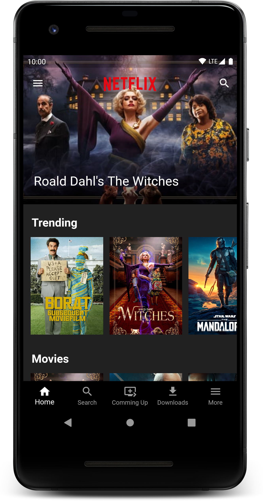
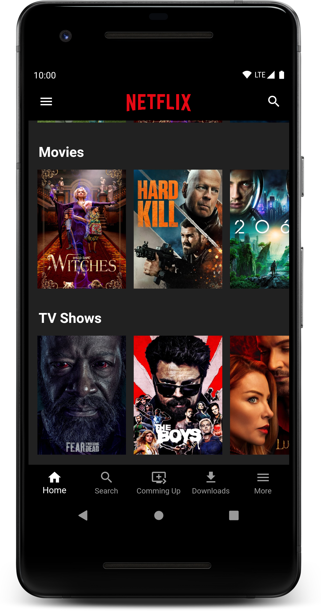
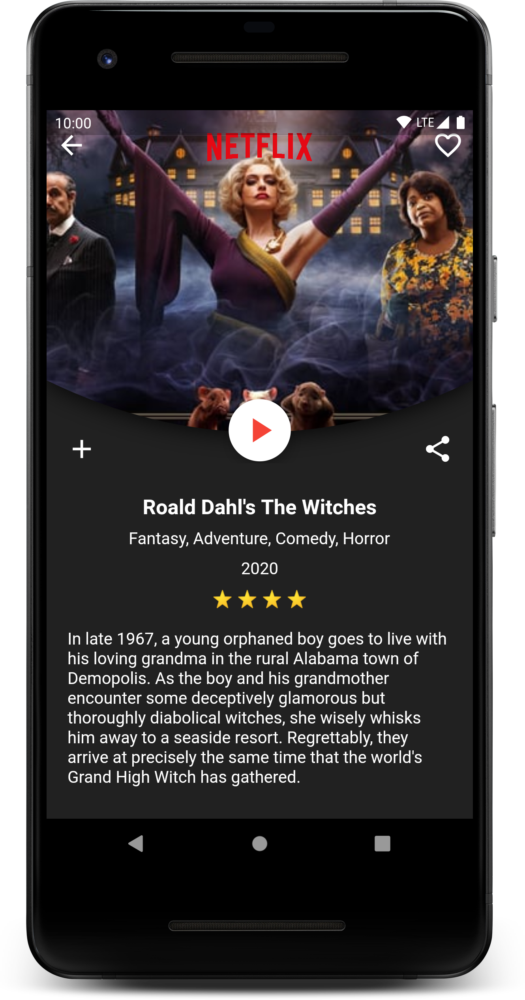

# Movies and TV Shows Streaming App

A videos streaming app UI inspired by popular app Netflix. A clean and slick app UI in dark mode. Learnt data manipulation and state management.

## Description

This is a UI of Videos Streaming app were you can watch Movies and TV Shows. It has a Carousel slider of popular Movies and TV Shows of the day. Contains a list of Trending Movies and TV Show of the week along with list of Movies and TV Shows to watch. Clicking on any of these contents opens a page which contain Details about that Movie/TV Show.

## ScreenShots 📷

  

## Technology Stack and Others

- Flutter
  - http: ^0.12.2
  - carousel_slider: ^2.3.1
- The Movie Database (TMDb) API
- VS Code

## Resourses

- [Lab: Write your first Flutter app](https://flutter.dev/docs/get-started/codelab)
- [Development: Data & backend](https://flutter.dev/docs/development/data-and-backend)
- [Cookbook: Useful Flutter samples](https://flutter.dev/docs/cookbook)
- [Online Documentation](https://flutter.dev/docs)
- [Marcus Ng](https://www.youtube.com/channel/UC6Dy0rQ6zDnQuHQ1EeErGUA)

## My Notes

Colors.black.withOpacity((scrollOffset / 230).clamp(0, 1).toDouble())
**TODO:** Other Content Pages, Build BottomNav Screens.

## Contributors

**Maintainer:** [Siddhant Chogle](https://github.com/SiddhantChogle)

## License

Project is published under the [MIT license](/LICENSE.md).

Feel free to ⭐ and fork Repo to modify/bug fix/improve the code as you want.
